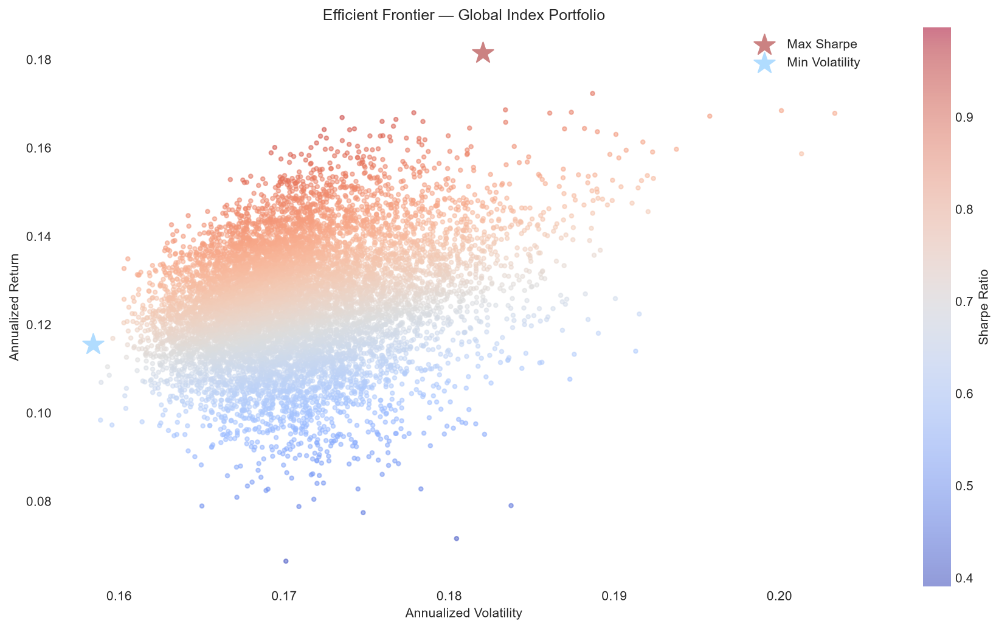

# Markowitz Portfolio Optimization. Global Stock Indices (2020–2025)

## Abstract
This project applies Modern Portfolio Theory (H. Markowitz, 1952) 
to a portfolio of 8 major global stock indices. Using daily 
price data from 2020 to 2025, I simulated 10,000 random 
portfolios to identify the optimal index-allocations that would
either maximize the Sharpe ratio or minimize volatility.

## Indices Used
| Ticker | Index | Country |
|---|---|---|
| ^GSPC | S&P 500 | USA |
| ^IXIC | Nasdaq | USA |
| ^FTSE | FTSE 100 | UK |
| ^GDAXI | DAX | Germany |
| ^FCHI | CAC 40 | France |
| ^N225 | Nikkei 225 | Japan |
| ^HSI | Hang Seng | Hong Kong |
| ^IBEX | IBEX 35 | Spain |

## Data
- **Source:** Yahoo Finance (yfinance)
- **Period:** January 2020 - December 2025
- **Frequency:** Daily
- **Observations:** 1,327 trading days

## Methodology followed
1. Download daily closing prices using yfinance
2. Calculate daily returns and annualize them (x252 trading days per year)
3. Simulate 10,000 portfolios with random weights
4. For each portfolio, calculate return, volatility and Sharpe ratio
5. Identify the portfolios with maximum Sharpe ratio and minimum volatility
6. Plot the Efficient Frontier

## Expected Annual Returns by Index
| Index | Annual Return |
|---|---|
| Nasdaq | 21.5% |
| Nikkei 225 | 17.5% |
| S&P 500 | 16.8% |
| DAX | 14.2% |
| IBEX 35 | 13.6% |
| CAC 40 | 8.1% |
| FTSE 100 | 6.7% |
| Hang Seng | 1.7% |

## Results

| Metric | Max Sharpe | Min Volatility |
|---|---|---|
| Annualized Return | 18.1% | 11.6% |
| Annualized Volatility | 18.2% | 15.8% |
| Sharpe Ratio | 1.00 | 0.73 |

### Max Sharpe Portfolio Weights
| Index | Weight |
|---|---|
| Hang Seng | 41.8% |
| IBEX 35 | 35.2% |
| FTSE 100 | 9.7% |
| Nikkei 225 | 6.5% |
| CAC 40 | 1.8% |
| DAX | 3.5% |
| S&P 500 | 0.8% |
| Nasdaq | 0.8% |

### Min Volatility Portfolio Weights
| Index | Weight |
|---|---|
| Nasdaq | 27.7% |
| IBEX 35 | 21.8% |
| DAX | 18.9% |
| CAC 40 | 14.6% |
| Nikkei 225 | 8.7% |
| FTSE 100 | 4.2% |
| Hang Seng | 2.6% |
| S&P 500 | 1.5% |

## Efficient Frontier Chart

The scatter plot shows all 10,000 simulated portfolios. 
Each point represents a different asset allocation, colored 
by its Sharpe ratio — from blue (low) to red (high). 
The red star marks the Maximum Sharpe portfolio and the 
blue star marks the Minimum Volatility portfolio.

The upper-left edge of the cloud is the Efficient Frontier: 
the set of portfolios that no other combination can beat in 
risk-adjusted terms.

## Key Findings
The Max Sharpe portfolio achieves a Sharpe ratio of exactly 
1.00, a strong benchmark in portfolio management. It is 
dominated by Hang Seng (41.8%) and IBEX 35 (35.2%), which 
showed strong risk-adjusted performance over the period 
despite not being the highest returning indices individually, 
a clear example of diversification benefits.

The Nasdaq, despite being the best performing index (21.5% 
annual return), receives almost no allocation in either 
portfolio. This is because its high volatility and strong 
correlation with other indices makes it inefficient in 
a diversified portfolio context.

The Nikkei 225 and Hang Seng show an interesting contrast: 
the Hang Seng dominates the Max Sharpe portfolio despite 
having the lowest individual return (1.7%), while the 
Nikkei receives minimal allocation despite returning 17.5%. 
This highlights how correlation structure matters as much 
as individual returns in portfolio construction.

## Tools
- Python
- yfinance · pandas · numpy · matplotlib

## Author
Irene Corral Trillo
Economics Student — Universidade da Coruña
